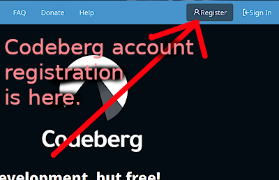

How to contribute
=================

This document attempts to cover how to contribute
to Horse64. If you want to fix a problem, help with
the documentation, etc., then please read on.


Contribute code
---------------

If you want to contribute code to any core tooling to
fix bugs or add new features, you should be aware of the
following:

1. Most deeper testing of the core tooling expects to be
   run *on Linux.* If you contribute a more complicated
   feature, you will be expected to test your pull request
   on Linux according to the [#maintainer-checklists](
   checklists below). **It's however possible to do
   more basic code changes and tests on Windows,
   even without using WSL2, as long as your code changes
   concern only Horse64 code and not the C parts of the
   tooling.**

2. [Read the licensing carefully](/docs/Resources.md#license)
   and make sure you agree to contribute your code under
   the given terms.

3. Changes can be suggested via **pull requests** in the
   [respective repositories](/docs/Resources.md).

   To set up a new pull request, try these steps (**warning**,
   you should know how to run commands in a terminal and
   how to change folders in a terminal, or you won't get
   very far):

   1. Make an account on codeberg.org if you haven't yet:

      

      Also, install **git for Windows** and any text
      editor for editing code.

   2. Go to the respective Horse64 project repository for
      whatever tool you want to patch.

   3. Click the "Fork" button on the codeberg page
      of the respective repository to get a personal
      fork, which is your own separate copy of the project.

   4. Clone your personal fork to your local machine with:

      ```bash
      git clone ...url-to-your-repo-fork-on-codeberg...
      ```

      (Run that in a terminal, on Windows
      e.g. the **git terminal**, in some folder where
      you keep your software projects. Check what folder
      your terminal is in first, via `pwd` or such!)

      Then switch to a new branch in your local repo with:

      ```bash
      git checkout -b name-for-your-branch
      ```

      (This needs to be run *inside* your new repo folder.)

   5. Implement and **test** your change.

   6. Make sure to set up a name and e-mail with your
      local git if you haven't yet, so people know who
      made this change. For that, you can run this in
      your local repo folder:

      ```bash
      git config user.name "John Doe"`
      git config user.email "my-mail@example.com"
      ```

   7. Now use:

      ```bash
      git commit -a
      ```
      ...to save and describe your changes
      to your local repository. Make sure to
      [add the developer certificiate of origin
      signature as specified in the license file](
      /docs/Resources.md#license).

      (If you added any new files, you might first
      need to use `git add name-of-file`.)

      Then use:

      ```bash
      git push origin name-for-your-branch
      ```
      ...to push your change to your personal fork on
      the code hoster.

   8. Now go to the original repository on Codeberg, **not
      your fork**, and click the "Pull Requests" tab and
      click "New Pull Request".

      For "merge into", make
      sure it's set to the project's original "main" branch.
      For "pull from", pick your personal fork and your
      `name-for-your-branch` branch.


Maintainer checklists
---------------------

These are maintainer checklists for all the core projects.

### Pull request checklist for core tooling

If you contribute a pull request

### Updating git hooks or issue forms

Whenever updating the git hooks, or the forms in the `.gitea` folder,
or the workflows to disable pull requests in the `.github` folder,
update them in this core.horse64.org repo first.

Then run (in the main repo folder):
```bash
python3 maintainer-helper-update-repos.py
```
...to propagate the changes to all the other repos.

(The other repos need to be cloned to neighboring repo folders,
neighboring your core.horse64.org repo folder.)

### Update all copyright notices for the next year

To update all copyright notices for the next year,
do the same steps as for [updating the git hooks for
all repos](#updating-git-hooks-or-issue-forms).

### Release checklist for core tooling

This release checklist should be completed before attempting
any release of what is part of the core tooling.

**What is part of the core tooling:** This list continuously
expands and is made up of what is needed to build *horp*,
*HVM*, and *the standard library*. **The authoritative latest
list for what is part of that, is maintained as part of
[tools/maintainer_helper_test_major_builds.h64](
maintainer_helper_test_major_builds.h64).**

**Steps required** before any official release of core tooling:

1. Be on Linux.

2. Set up all the core tooling repo folders next to each other in
   the versions to be tested, including what you plan to release.

3. Run this and follow the instructions:

   ```bash
   translator/horsec_run.py tools/maintainer_helper_test_major_builds.h64
   ```

4. If it reports an error at any point, it should be fixed
   before a release.

5. Now you should run whatever tests the respective
   project or package offers. For HVM, that would usually be
   `make test`, and for the others that would usually be via
   `horp test`. If there are any errors, make sure to investigate
   if any are new!
